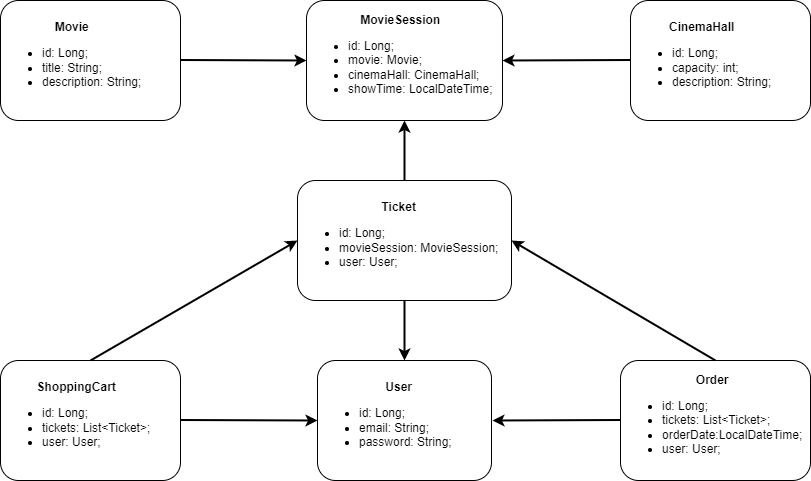

# Cinema-app

Web application example that supports authentication, registration and CRUD operations.
Manage cinema by adding new movies, movie sessions, adding cinema halls.
With registering new user the shopping cart linked to user will be created. 
After login as user add movie sessions to shopping cart and create orders to purchase tickets.  
(to familiarize with detailed entities relations, please, refer to chart below)

# Technologies used:

- Java 11
- Spring (Context, Web, Security)
- Servlet
- Jackson
- Tomcat
- MySQL
- Hibernate
- HQL
- Maven

# Application functionality

- registration 
- authentication 
- add/get cinema hall;
- add/get movie
- add/get/get all by date movie sessions;
- add session to shopping cart;
- complete order after adding sessions to shopping cart;
- get order history for user

# Endpoints description

| Endpoint        | HttpMethod | Action                        | Requiered role | Inputs (JSON)       |
|-------------------|-----------------|-----------------------------|--------------------|--------------|
| /register          | POST          | Register new user	| any	        | String: email; String: password; String: repeatPassword |
| /login	       | POST          | Login 		| any	        | String: email; String: password |
| /cinema-halls  | POST          | Add new cinema hall to DB | ADMIN    | int: capacity; String: description |
| /cinema-halls  | GET          | Show list of all cinema halls | any    | n/a |
| /movies | POST          | Add new movie DB| ADMIN    | String: title; String: description |
| /movies | GET          | Show list of all movies | any    | n/a |
| /movie-sessions  | POST          | Add new movie session to DB | ADMIN    | Long: movieId; Long: cinemaHallId; LocalDateTime: showTime |
| /movie-sessions/{id}  | PUT          | Update movie session by Id | ADMIN    | PathVariable {id} = MovieSession id; Long: movieId; Long: cinemaHallId; LocalDateTime: showTime |
| /movie-sessions/{id}  | DELETE          | Delete movie session by Id | ADMIN    | PathVariable {id} = MovieSession id; |
| /movie-sessions/available?movieId={id}  | GET | Show all avaliable movie sessions by movie Id | any    | RequestParam {id} = Long: movieId |
| /shopping-carts/by-user  | GET | Show shopping cart details | USER    | n/a |
| /shopping-carts/movie-sessions?movieSessionId={id}  | PUT | Add movie session to shopping cart | USER    | RequestParam {id} = Long: movieSessionId |
| /orders/complete  | POST | Complete order based on shopping cart | USER    | n/a |
| /orders  | GET | Show orders history | USER    | n/a |
| /users/by-email?email={email} | GET | Find user by email | ADMIN    | RequestParam {email} = String: email |

# To install the app:

1) Clone the project to your machine 
2) Download MySQL and MySQL Workbench
3) In src/main/resources/db.properties delete plugs and insert appropriate properties:
- hibernate.dialect &rarr; hibernate dialect (ex. "org.hibernate.dialect.MySQL8Dialect");
- db.url &rarr; url of schema in MySQL database;
- db.driver &rarr; (ex. com.mysql.cj.jdbc.Driver);
- db.username &rarr; username according to DB settings;
- db.password &rarr; password according to DB settings;
- hibernate.show_sql &rarr; true to see queries executed by hibernate in console;
- hibernate.hbm2ddl.auto &rarr; hibernate strategy of shema generation (recommended: "create-drop")
4) Configure Apache Tomcat: 
> Add/edit configuration &rarr;
> Add new &rarr;
> Choose TomcatServer(local) &rarr;
> In Application server field put path to folder with tomcat &rarr;
> Switch to Deployment tab and add "taxiservice:war exploded" &rarr;
> Clear Application context path to "/" &rarr;
> Select apply and Run the app 
5) You're welcome to use Postman to test the application.

### Model structure 

